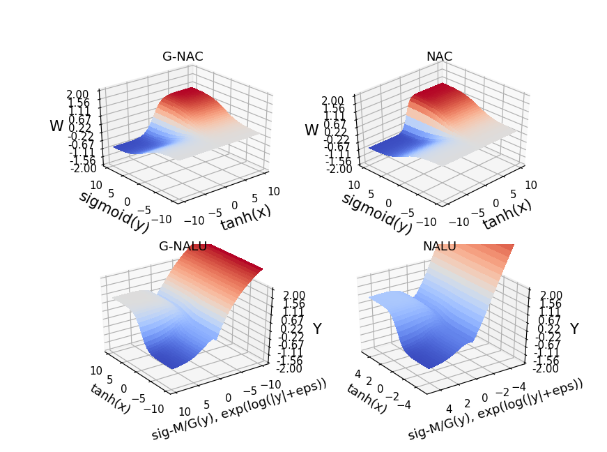

# Experiment Description & Setup

This section contains visualizations of NAC and NALU units. Also, it shows comparison their comparison with golden ratio based
activated NAC and NALU variants.

From this setup we do observe a much smoother surface transition in golden ratio based NAC/NALU units as compared to regular NAC/NALU units.

# Usage Instructions

* For displaying the below mentioned graphs just execute `python3 master_plot.py` on your linux machine.
* Also, for displaying any of the subgraph. Just, comment out the rest of the code for displaying only single graph component
  and execute the above command only.

## Plots for NACs, NALUs, G-NACs and G-NALUs

Slope variations for gradient updates while propgating value transformations highlighted in combination of these plots.

